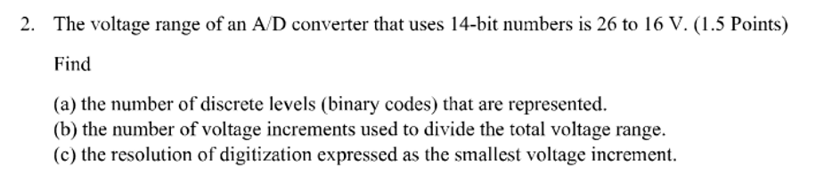
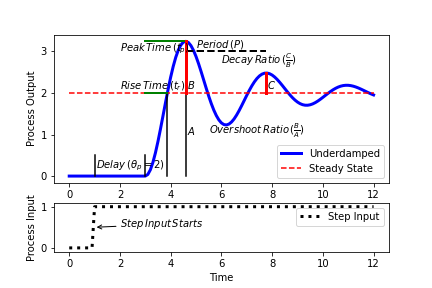

### Example for determining AD Converter BIT resolution.

a) `For 14 bits, The number of discrete levels represented is 16384 binary codes`
b)`For 16384 bin codes, the number of voltage increments used to divide total voltage range is 16383`
c) `For voltage range of 10 V and number of voltage increments is 16383, Resolution is 0.610 mV`

### Additional functions
1) AM Signal modulation
2) Signal to Noise Ratio (SNR)
3) Data Rate

## Response Plot (Deprecated)
