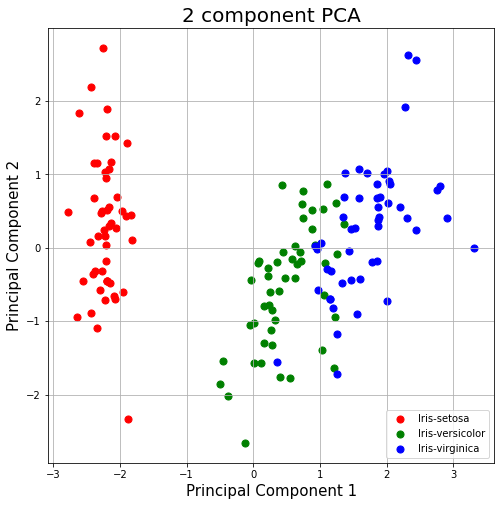
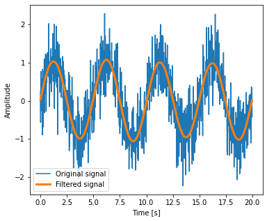

# Facial Recognition Demo using sklearn library 

### Content

1) **SVD** (Singular Value Decomposition) matrix decomposition
2) **SVD** on handwritten digit. 
3) **PCA**(Principle Component Analysis) on Iris Data
4) Signal **FFT** (Fast Fourier Transform) and recursion method.
5) **FFT** Visualization
6) **PCA** with multiple faces. 

### 2 Component PCA

### Filtered Signal with FFT
