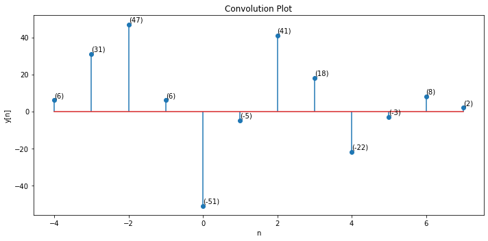
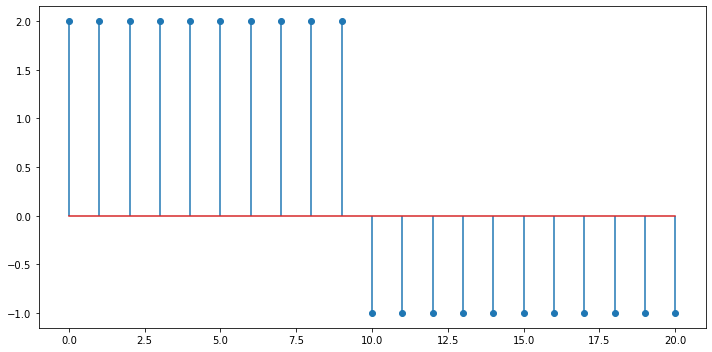

# Some Signal Plotting Examples using Matplotlib

### Transfer Function Demo

# Digital Signals
### Convolution 
*Clean and Matlab like*

#### Unit Step `2u[n-10] - 3u[n - 20]`

#### *Includes some tools for shifting, flipping, and folding.*

# More DSP Functions

1) Compute sum of sinusoid
* $\sum_{n=0}^{n} Asin(2 \pi f n) $

`Frequency = 1.00 Hz`
`Amplitude = 1.00 units`
`Ang Freq  = 6.28 Rad/s`
`Period    = 1.00 s`
`Step size = 0.02`
`Sample range: (0.0 < n < 1.0)`

## DFT
- Get Real, imaginary, phase, and magnitude

### Filters 
2) Butterworth filter example. **(FIR)**
3) Hann, Hamm, and Rect window function that determines ideal window based on stop band attenutation. 
4) Chebyshev, Elliptic  **(IRR)**

5) Plotly Interactive Sinewave

